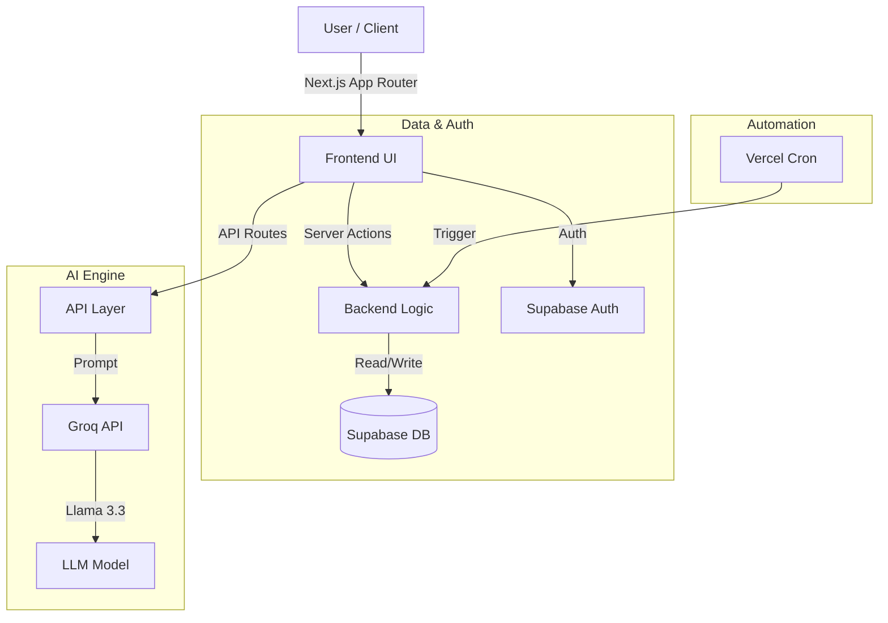
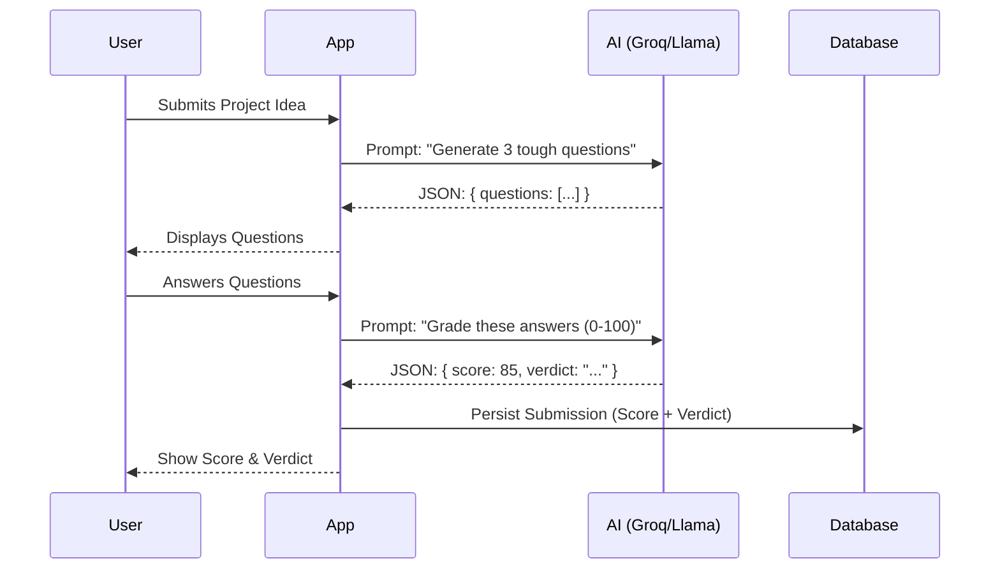

# TeamSync AI - Interview Demo Guide

This document is your cheat sheet for the interview. It covers **what to show**, **what to say**, and **visual diagrams** to explain the architecture and logic.

---

## 1. The "Elevator Pitch" (Start here)

> "TeamSync AI is an intelligent team formation and evaluation platform. It solves the problem of manual team shuffling and subjective project feedback by automating the process and using AI as an objective 'Vibe Judge'. It's built to be fast, fair, and fun."

---

## 2. Visual Architecture

Use these diagrams to explain how the system works under the hood.

### A. High-Level Architecture
*Explain that you chose a modern, serverless-friendly stack for speed and scalability.*

### B. The "Vibe Check" Flow
*Explain how you use AI to generate structured JSON data, not just text.*

---

## 3. Demo Walkthrough Script

Follow this flow to demonstrate the features naturally.

### Step 1: The Dashboard (The "Hook")
*   **Action**: Open the home page.
*   **Say**: "Here is the main dashboard. It's designed to be a 'Single Pane of Glass' for the user. You can see your current team, the countdown to the next shuffle, and the leaderboard."
*   **Highlight**:
    *   **Next Shuffle Timer**: "I implemented this to create a sense of urgency and rhythm. It's powered by a Cron job that runs monthly."
    *   **Hall of Fame**: "This shows the top-performing teams, creating friendly competition."

### Step 2: Team Formation (The "Magic")
*   **Action**: (If Admin) Click "Randomize Teams".
*   **Say**: "Traditionally, forming teams is a manual headache. I automated this with a Fisher-Yates shuffle algorithm."
*   **Technical Detail**: "This runs as a Server Action for security. It transactionally clears old teams and assigns new ones in a single batch operation to ensure data integrity."

### Step 3: The Vibe Check (The "AI Integration")
*   **Action**: Enter a project name (e.g., "Uber for Cats") and description. Click "Generate Questions".
*   **Say**: "This isn't just a form. It's an AI product coach. It analyzes the specific idea and generates tailored questions."
*   **Action**: Answer the questions and click "Run Vibe Check".
*   **Say**: "Now the AI acts as a judge. It evaluates the answers for clarity and realism, assigns a score out of 100, and gives a witty verdict. We persist this score to the database to populate the leaderboard."

---

## 4. Key Technical Decisions (Q&A Prep)

**Q: Why did you use Next.js App Router?**
**A:** "I wanted to leverage **Server Components** for fast initial loads (fetching user data directly on the server) and **Server Actions** for type-safe mutations without writing separate API endpoints for everything."

**Q: How do you handle the 'Monthly' requirement?**
**A:** "I used **Vercel Cron** to hit a secure API endpoint (`/api/cron/randomize`) on the 1st of every month. This decouples the scheduling from the application logic."

**Q: Why Groq/Llama instead of OpenAI?**
**A:** "Groq offers incredibly low latency, which is crucial for the 'Vibe Check' to feel responsive. Waiting 10 seconds for a grade kills the user experience; Groq delivers it in under 2 seconds."

**Q: How did you handle the 'Decommissioned Model' error?**
**A:** "I encountered an issue where `llama-3.1` was deprecated. I quickly diagnosed it via server logs and migrated to `llama-3.3`, verifying the fix with `curl` tests before deploying."

---

## 5. Future Roadmap (Showing Product Vision)

End the interview by showing you're thinking ahead.

1.  **Slack/Discord Integration**: "Pushing notifications when teams are shuffled or when a team gets a high score."
2.  **Multi-Round Iteration**: "Allowing teams to refine their answers based on AI feedback to improve their score."
3.  **Skill-Based Matching**: "Instead of pure random, using AI to balance teams based on skills (e.g., 1 frontend + 1 backend + 1 designer)."
