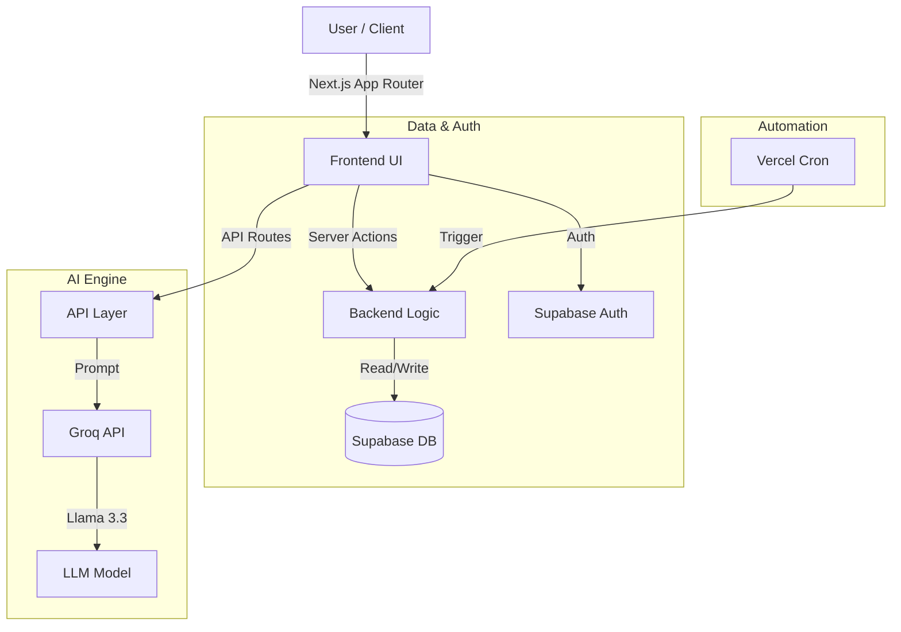
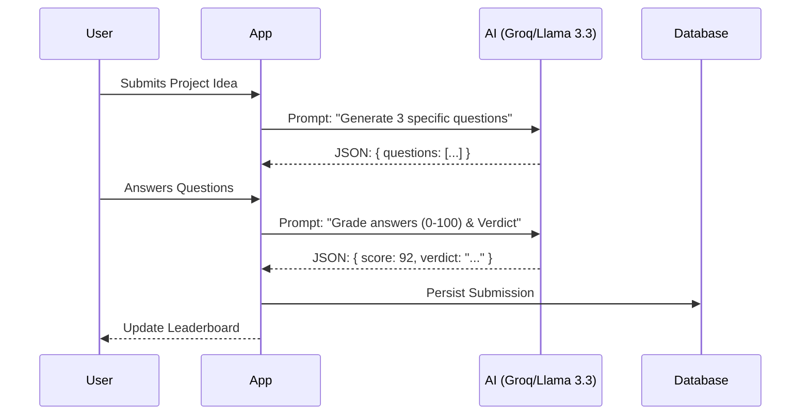

# TeamSync AI
### Intelligent Team Formation & Evaluation Platform

---

## 1. Overview

**TeamSync AI** solves the chaos of manual team formation and subjective project evaluation. It is an automated, AI-driven platform designed to build balanced teams and provide objective, actionable feedback on project concepts.

*   **Fast**: Instant team generation and sub-second AI feedback.
*   **Fair**: Randomized, unbiased team shuffling.
*   **Fun**: Gamified "Vibe Checks" with witty AI verdicts and leaderboards.

---

## 2. System Architecture

Built on a modern, serverless-first stack designed for performance and scalability.

### High-Level Stack

### The "Vibe Check" Engine

How we turn unstructured project ideas into structured, quantitative data.

---

## 3. Core Features

### 🔄 Automated Team Formation
*   **Algorithm**: Fisher-Yates Shuffle for unbiased randomization.
*   **Execution**: Transactional Server Actions ensure data integrity.
*   **Cadence**: Automated monthly reshuffling via Vercel Cron.

### 🤖 AI Vibe Judge
*   **Model**: Powered by **Llama 3.3 70B** on **Groq** for ultra-low latency.
*   **Function**: Acts as an objective product coach.
*   **Output**: Generates project-specific probing questions and assigns a "Vibe Score" (0-100).

### 🏆 Gamification & Engagement
*   **Leaderboard**: "Hall of Fame" tracking top-performing teams.
*   **Urgency**: "Next Shuffle" countdown timer drives engagement.
*   **Feedback Loop**: Instant, witty verdicts encourage iteration.

---

## 4. Technical Highlights

*   **Next.js 16 (App Router)**: Leveraging Server Components for zero-bundle-size data fetching.
*   **Supabase**: Managed PostgreSQL with Row Level Security (RLS) for robust data protection.
*   **Type Safety**: End-to-end TypeScript from database schema to UI components.
*   **Resilience**: Graceful error handling and fallback strategies for AI model availability.

---

## 5. Future Roadmap

*   **Slack/Discord Bot**: Push notifications for team shuffles and high scores.
*   **Skill-Based Matching**: AI-driven team balancing (e.g., matching Frontend + Backend + Design).
*   **Multi-Round Iteration**: Allowing teams to refine their pitches based on AI feedback.
